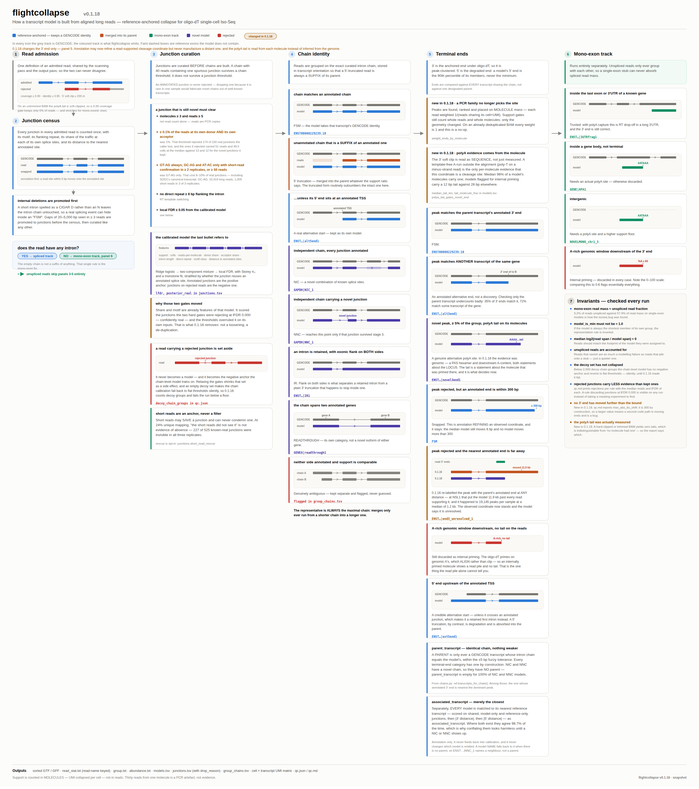

# flightcollapse v0.1.18

`flightcollapse` collapses aligned long reads into reference-anchored transcript
models for oligo-dT single-cell Iso-Seq / FLIGHT-seq data. It is designed to
preserve supported novelty without turning 5' truncation, weak splice junctions,
PCR duplication, or internal priming into transcript models.

This repository is a collaborator-evaluation snapshot of **v0.1.18**. The
runtime source is byte-for-byte identical to the installed v0.1.18 package from
the stable source archive. See [provenance and validation](docs/SCHEME_VALIDATION.md).

## Why develop another collapse method?

In these data, raw Iso-Seq collapse and downstream Pigeon filtering expose a
difficult trade-off: permissive catalogues retain possible discoveries but can
keep growing with sequencing depth, while aggressive filtering improves
specificity at the cost of potentially real low-abundance structures.
`flightcollapse` aims for a middle ground: reference anchoring and explicit
artifact controls, with supported novel junctions, chains, and terminal ends
still eligible for discovery.

Selected results from the linked project benchmarks:

- In BD67 and BD70, raw collapse produced 993,239 and 835,880 models. v0.1.18
  retained 204,447 and 183,396 after curation.
- The v0.1.18 catalogues recovered 95.5% and 95.1% of their Chao1-estimated
  pools and were adding about 618 and 725 models per additional million reads
  at full depth. The raw catalogues were still adding about 33,000 models per
  million reads.
- In the earlier v0.1.16 chromosome-1 benchmark, `flightcollapse` recovered
  87.3% of hidden transcripts at matched output size, while 0.49% of its novel
  models carried a non-canonical junction and 42% of the catalogue survived a
  >=20-read filter. Its normalized cross-sample reproducibility ratio was 0.81.

The last result is historical evidence from v0.1.16, not a v0.1.18 re-run.
Pigeon's reported zero non-canonical rate is also not an independent precision
estimate because non-canonical junctions are one of its filter criteria. These
benchmarks support evaluation; they do not establish a universal best caller.

Direct benchmark artifacts:

- [Where the callers disagree: five worked loci](https://claude.ai/code/artifact/a0244da6-e7c9-4520-b552-e4aab28a2f84)
- [Raw collapse saturation in BD67 and BD70](https://claude.ai/code/artifact/17fa63d2-e3d4-4a66-8a8c-55edc862d18c)
- [flightcollapse v0.1.18 saturation](https://claude.ai/code/artifact/7a88a962-0b1c-406c-9da5-33d4f7d26858)
- [Six-caller chromosome-1 benchmark and reproducibility](https://claude.ai/code/artifact/13ec4ba1-f5b7-4053-b786-5b89a53bc03a)

## Algorithm overview

[](docs/flightcollapse_logic_v0.1.18.pdf)

The current implementation follows the scheme:

1. Admit reads using one shared set of alignment gates.
2. Build and annotation-snap a junction catalogue before building chains.
3. Curate novel junctions using molecule/read support, splice motif, local site
   share, RT-switch evidence, and calibrated local FDR.
4. Group exact curated chains and resolve 5' suffix relationships toward the
   maximal, reference-supported chain unless independent TSS evidence supports
   an alternative start.
5. Cluster terminal ends, using molecule-weighted 3' peaks and direct clipped
   polyA-tail evidence; annotation may refine a nearby observed end but cannot
   manufacture a distant one.
6. Process mono-exonic reads on a separate track and check invariants on every
   run.

The diagram is consistent with the source and tests under the intended setup:
a genome FASTA and barcode/UMI table are supplied. Without a UMI table, support
falls back to reads. Without a genome FASTA, splice motifs cannot be classified,
so the default permits the `unknown` motif class. Full details are in the
[scheme validation note](docs/SCHEME_VALIDATION.md), with a vector version of
the figure [available here](docs/flightcollapse_logic_v0.1.18.svg).

## Relationship to SQANTI3/Pigeon categories

[Pigeon](https://isoseq.how/classification/categories.html) follows the [SQANTI3 structural-category convention](https://github.com/ConesaLab/SQANTI3/blob/master/docs/SQANTI3_isoform_classification.md). Those categories describe how a finished transcript model relates to a reference annotation. flightcollapse categories are assigned earlier, while reads are being consolidated into models, and additionally describe terminal-end evidence. The relationship is therefore a crosswalk rather than a one-to-one renaming.

Most importantly, a Pigeon/SQANTI3 **FSM** (full-splice match) means that the internal splice chain matches an annotated transcript; its exact 5′ and 3′ ends may still differ. flightcollapse uses those differences to split an FSM-like chain into more informative categories:

| Pigeon/SQANTI3 result | Likely flightcollapse category | Interpretation in flightcollapse |
|---|---|---|
| `full-splice_match` (FSM) | `FSM` | Splice chain and both ends match one annotated transcript within the configured tolerances. |
| `full-splice_match` (FSM) | `end3_annotated` | The chain matches one transcript, but the 3′ end matches an annotated end of another isoform. |
| `full-splice_match` (FSM) | `end3_novel` | The chain is annotated, but flightcollapse accepts a new poly(A)-supported 3′ end. |
| `full-splice_match` (FSM) | `end3_unresolved` | The chain is annotated, but the observed 3′ end is displaced and does not satisfy the evidence required for a trusted novel end. |
| `full-splice_match` (FSM) | `end5_alt` | The chain is annotated, but the 5′ end uses an alternative annotated transcription start site. |
| `full-splice_match` (FSM) | `end5_extended` | The chain is annotated, but its supported 5′ end extends beyond the annotated starts. |
| `full-splice_match` (FSM) | `end5_truncated` | Optional category for a shorter 5′ end; disabled by default in v0.1.18. |
| `incomplete-splice_match` (ISM) | usually merged; sometimes `NIC`, `NNC`, or a mono-exon category | A 5′-truncated chain suffix is normally merged into its maximal annotated parent rather than reported as a separate ISM model. A protected model—for example one with independent start evidence—can survive under another category. flightcollapse intentionally has no general `ISM` output category. |
| `novel_in_catalog` (NIC) | `NIC`, or sometimes `NNC` | flightcollapse calls `NIC` only when every complete donor–acceptor junction pair is annotated. A new pairing of individually known donor and acceptor sites is therefore `NNC` in flightcollapse, although SQANTI3/Pigeon can call it NIC. |
| `novel_not_in_catalog` (NNC) | `NNC` | At least one complete splice junction is novel after flightcollapse junction curation. |
| FSM, NIC, or NNC with intron retention | `IR` | A dedicated flightcollapse label for a reference-like chain with one or more introns read through. Its Pigeon/SQANTI3 structural category depends on the resulting exon/junction structure. |
| FSM, genic, fusion, or another context-dependent class | `READTHROUGH` | The supported 3′ end continues beyond the annotated gene boundary. This is an end-behaviour label, so there is no single equivalent Pigeon/SQANTI3 structural category. |
| FSM, genic, or genic-intron | `monoexon_3UTR` or `monoexon_internal` | Unspliced models inside a known locus. `monoexon_3UTR` lies in the terminal exon/3′ UTR; `monoexon_internal` is an internal gene-body model and requires poly(A) evidence. |
| intergenic | `monoexon_intergenic` | A supported unspliced model outside annotated genes; v0.1.18 applies poly(A) and elevated read-support requirements. |
| antisense or fusion | no direct equivalent | These are not dedicated flightcollapse v0.1.18 categories. Inspect the strand, locus association, `flags`, and `associated_transcript`; the model may instead be represented as `NIC`, `NNC`, or `READTHROUGH`, or may be filtered. |

This table gives the expected conceptual mapping, not a deterministic conversion. The result also depends on the annotation release, strand and locus assignment, end/junction tolerances, and the Pigeon/SQANTI3 version. For a definitive comparison, run Pigeon on the GFF produced by flightcollapse and join the records by transcript ID. In `*.models.tsv`, the most useful flightcollapse columns are `category`, `parent_transcript`, `associated_transcript`, `dist_to_ref_tss`, `dist_to_ref_tts`, `end3_from`, `structural_diff`, and `flags`.

## Install

Requirements: Python 3.9 or newer. The Python dependencies are `pysam`,
`numpy`, and `pandas`.

```bash
git clone https://github.com/irinakhven/flightcollapse.git
cd flightcollapse
python3 -m venv .venv
source .venv/bin/activate
python -m pip install --upgrade pip
python -m pip install -e ".[test]"
pytest -q
flightcollapse --version
```

Expected final lines are `203 passed` and `flightcollapse 0.1.18`.

After the repository is published and tagged, it can also be installed directly:

```bash
python -m pip install \
  "flightcollapse @ git+https://github.com/irinakhven/flightcollapse.git@v0.1.18"
```

## Files needed to run

Required inputs:

- a coordinate-sorted aligned BAM and its `.bai` index; the BAM should
  preferably be PCR/UMI-deduplicated so that each retained alignment represents
  a distinct input molecule;
- the reference annotation GTF used for the analysis;
- the matching genome FASTA and its `.fai` index.

Recommended or optional inputs:

- a read-name-keyed barcode/UMI TSV with the columns `read_name`,
  `cell_barcode`, and `umi` (recommended for molecule-aware thresholds and the
  cell-by-transcript matrix);
- a PolyASite / PolyA_DB BED of known cleavage sites;
- one or more STAR `SJ.out.tab` files for independent short-read junction
  anchoring.

A deduplicated BAM is preferred even though flightcollapse can use the optional
barcode/UMI table for molecule-aware support. If a non-deduplicated BAM is used,
provide that table whenever possible; otherwise duplicate alignments are counted
as independent reads and can inflate read-based support thresholds.

The repository files required for installation are `pyproject.toml` and
`src/flightcollapse/`. `tests/` is needed only to validate the installation;
`docs/` is documentation. Do **not** copy or publish the development virtual
environment, BAMs, reference genomes, or analysis outputs.

Prepare indexes if needed:

```bash
samtools sort -o reads.sorted.bam reads.bam
samtools index reads.sorted.bam
samtools faidx GRCh38.fa
```

## Run

First verify that BAM read names match the barcode/UMI table:

```bash
flightcollapse diagnose-umi \
  -b reads.sorted.bam \
  -u sample_barcode_umi.tsv
```

Then run the collapse:

```bash
flightcollapse run \
  -b reads.sorted.bam \
  -g gencode.v44.annotation.gtf \
  -f GRCh38.fa \
  -u sample_barcode_umi.tsv \
  --polya-bed polyasite_hg38.bed \
  --short-read-sj rep1_SJ.out.tab rep2_SJ.out.tab rep3_SJ.out.tab \
  -o flightcollapse_out \
  -p sample
```

Both `--polya-bed` and `--short-read-sj` may be omitted. Omitting `-u` disables
molecule-aware counting and the cell-by-transcript matrix.

To inspect all defaults or change one explicitly:

```bash
flightcollapse config > flightcollapse.config.json
flightcollapse run -c flightcollapse.config.json \
  --set ends.max_3p_diff=50
```

## Main outputs

- `{prefix}.gtf` / `{prefix}.gff`: transcript models
- `{prefix}.models.tsv`: model category, support, parent/associated transcript,
  polyA evidence, and flags
- `{prefix}.read_stat.txt` and `{prefix}.group.txt`: read assignments
- `{prefix}.abundance.txt` and `{prefix}.flnc_count.txt`: compatible counts
- `{prefix}.junctions.tsv.gz`: junction evidence and keep/drop reasons
- `{prefix}.group_chains.tsv`: chain composition of model groups
- `{prefix}_umi_corrected_isoform_matrix.mtx` plus row/column metadata: molecule
  matrix when a barcode/UMI table is supplied
- `{prefix}.qc.json` / `{prefix}.qc.md`: validation and read-accounting report

Additional technical detail is retained in [Technical notes](docs/TECHNICAL_NOTES.md).

## Status and license

v0.1.18 is research software prepared for collaborator evaluation. Pin the
`v0.1.18` tag when reproducing results. Licensed under the MIT License; see
[LICENSE](LICENSE).
