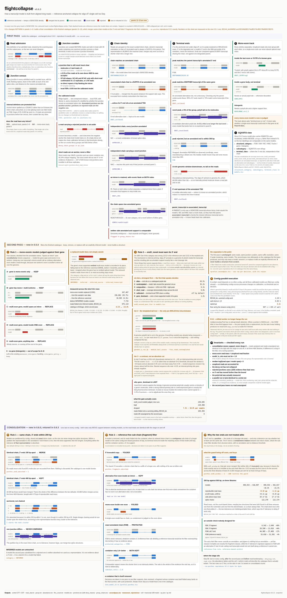

# flightcollapse v0.6.3

`flightcollapse` collapses aligned long reads into reference-anchored transcript
models for oligo-dT single-cell Iso-Seq / FLIGHT-seq data. It is designed to
preserve supported novelty without turning 5' truncation, weak splice junctions,
PCR duplication, or internal priming into transcript models.

See [provenance and validation](docs/SCHEME_VALIDATION.md).

## New in v0.6.3: the defaults the three-library benchmark chose

0.6.0 shipped a 3′ tolerance of 500 bp on the strength of one SIRV panel, with
a note in the source that BD144_HM and BD144_ND would confirm it before
release. They did not, so the defaults have moved:

| | 0.6.0–0.6.2 | **0.6.3** |
|---|---|---|
| `posthoc.end3_tolerance` | 500 | **200** |
| `posthoc.end5_window` | 100 | **−1** (off) |

Three-way reproducibility over BD144_kin / HM / ND, measured as the share of
assigned reads sitting on a transcript structure found in all three libraries —
the only measure a consolidation step cannot bias, since merging two
reproducible structures into one always lowers a count-based share:

| 3′ tolerance | models | reproducible read mass | at ≥50 reads, ≥100 barcodes | positive cells |
|---|---|---|---|---|
| **200 bp** | 499,553 → 418,097 (−16.3%) | **−0.32 pp** | **+0.11 pp** | 34 of 81 |
| 500 bp | 499,553 → 392,017 (−21.5%) | −1.11 pp | −0.25 pp | 17 of 81 |

The extra 300 bp buys its further 26,080 merges with reproducible read mass.
At the splice-chain level the two are indistinguishable — 122,270 chains
against 122,174 — which is what says the tolerance is doing 3′ work only, and
that the chain-level cost (−8.6% of chains) belongs entirely to the fragment
filter, identical in both arms.

Turning the 5′ guard off makes the asymmetry explicit and is close to free
(24–5,664 further merges per arm, ≤0.03 pp of mass): **the 3′ end gets a
tolerance, the 5′ end gets the structural sub-chain filter and nothing else.**
A 3′ end is a peak position that only a tolerance can judge; a 5′ truncation is
a containment relation the filter can decide from structure.

Because the guard is now off by default, `--no-subchain-filter` on its own is
rejected — with both off nothing would be looking at the 5′ end at all. Pass
`--set posthoc.end5_window=100` alongside it if that is what you want.

SIRV Set 4 is not retracted: it still shows the fragment filter is worth 26
points of annotation-free precision at no cost in recall, and that 500 loses no
exact-match recall. Its 69 transcripts have ground truth and almost no 3′-end
diversity; the HEK libraries have 418,097 models and no ground truth. Both
numbers are kept in `PosthocParams`, which says why.

An independent check came from pigeon. The sub-chain filter never consults an
annotation, yet the SQANTI3 classes it empties are exactly the fragment classes
— in BD144_kin, ISM 3′ fragments −60% and ISM 5′ fragments −44%, against −4%
for exact reference matches, while the 3′ tolerance's own signature shows up as
−17% in *FSM with an alternative 3′ end*.

`--end3-tolerance 500 --set posthoc.end5_window=100` restores the 0.6.0–0.6.2
behaviour exactly.

## New in v0.6.1 and v0.6.2

- **0.6.1** — the indexed sub-chain search keyed candidate containers on
  `(strand, position bucket)` without the contig. The pipeline calls the filter
  once per contig, so no 0.6.0 run is affected; it bites only when the function
  is called on a whole catalogue at once. Now keyed on `(contig, strand,
  bucket)`.
- **0.6.2** — `posthoc.end5_window` accepts a negative value, which removes the
  5′ guard entirely and leaves the 5′ end to the sub-chain filter. This is what
  0.6.3 turns on by default.

## New in v0.6.0: final consolidation (3' tolerance + fragment filter)

A last stage runs on every contig after the second pass and before read
bookkeeping, so `group.txt`, `read_stat`, the abundance tables and the
molecule matrix all describe the consolidated catalogue. Both rules move
reads; neither drops read mass (`fold_reads = true`). Every decision is written
to `{prefix}.posthoc.tsv`.

**1. Same-chain 3' consolidation (`--end3-tolerance`, default 200 bp since
v0.6.3; 500 in v0.6.0–v0.6.2).**
Models are compared only within one contig, strand and *identical* intron
chain, so two splice structures are never merged. Within a chain the
representative is the annotated 3' end if there is one, otherwise the best
supported end, then the longest. Models whose 5' end is within
`posthoc.end5_window` (off by default since v0.6.3) and whose 3' end is within
the tolerance **of that representative** are absorbed; the next unabsorbed model starts the next
cluster, so no cluster spans more than the tolerance however dense the
catalogue is. `--end3-tolerance 0` merges only identical 3' ends and `-1`
switches the rule off.

The 5' window is a guard rather than a knob: with it on, the rule cannot merge
models that differ by an alternative TSS — at the price that a 5'-truncated
copy of a model never merges either, because it shares that model's chain
exactly and so is invisible to the fragment filter as well. v0.6.3 takes the
guard off and accepts the first case to fix the second; `--set
posthoc.end5_window=100` puts it back.

**2. Reference-free sub-chain (fragment) filter (on by default).**
A model is removed, and its reads folded into the container, when all of
these hold:

- its ordered intron chain is a contiguous sub-chain of a longer model on the
  same strand, every junction within ±5 bp;
- its terminal exons lie inside the matching exons of that model, ±50 bp, so
  an alternative first exon starting inside an intron is kept;
- the container carries ≥ 2× its support (`--subchain-ratio`).

A mono-exonic model inside one exon of such a model is also a fragment.
Exact annotated chains (FSM) are never removed, and INFERRED models are left
alone. `--no-subchain-filter` disables the rule.

SIRV Set 4 benchmark (BD144_kin, 69 conventional SIRVs, exact model = junctions
±5 bp, ends ±50 bp), starting from the 0.5.1 output:

| arm | read filter | N = 0 | N = 200 | **N = 500** | N = 1000 |
|---|---|---|---|---|---|
| no annotation | none | 0.54 / 0.84 / 0.66 | 0.73 / 0.84 / 0.78 | **0.82 / 0.84 / 0.83** | 0.86 / 0.83 / 0.84 |
| no annotation | ≥ 50 reads | 0.76 / 0.84 / 0.80 | 0.83 / 0.84 / 0.83 | **0.88 / 0.84 / 0.86** | 0.89 / 0.83 / 0.86 |
| reference | none | 0.74 / 0.87 / 0.80 | 0.80 / 0.87 / 0.83 | **0.86 / 0.87 / 0.86** | 0.92 / 0.87 / 0.90 |
| reference | ≥ 50 reads | 0.87 / 0.87 / 0.87 | 0.92 / 0.87 / 0.90 | **0.94 / 0.87 / 0.90** | 0.94 / 0.87 / 0.90 |

Values are precision / recall / F1; N is the 3' tolerance, both rules applied.
The same run with neither rule scores 0.28 / 0.84 / 0.42 without annotation, so
the fragment filter alone (the N = 0 column) is worth 26 points of precision at
no cost in recall. **N = 500 is the largest tolerance that loses no recall in
either arm**; at N = 1000 the annotation-free arm gives up one true model. Read
mass is conserved exactly, and `--no-posthoc` restores 0.5.x output byte for
byte.

Other annotation-free callers on the same data: IsoQuant 0.89 / 0.67 / 0.76,
FLAIR transcriptome mode 0.53 / 0.86 / 0.65 (0.69 / 0.86 / 0.77 at ≥ 50 reads),
Bambu 1.00 / 0.25 / 0.40.

## New in v0.5.0: parallel contigs, and a second filtering pass

Two changes, one about speed and one about what ends up in the catalogue. The
model-**building** algorithm is unchanged: same reads, same junction curation,
same suffix resolution, same 3'-peak clustering, same models.

### Parallel contigs (`-j N`)

`run` has always streamed one contig at a time. Contigs are independent -- and
so are all three calibrated models, which were already fitted per contig -- so
they can be distributed over processes without changing a single threshold.

```bash
flightcollapse run ... -j 12        # 0 = all cores, 1 = serial (default)
```

Everything genuinely global is assembled in the parent in contig order: model
ids and the `PB.N` numbering, `read_stat` / `group` (stitched from per-contig
shards) and the molecule matrix. **A parallel run is byte-identical to a serial
one**, and `tests/test_parallel.py` asserts exactly that -- every comparison in
this project assumes two runs differing only in machine settings are the same
run.

Two things worth knowing. Wall-clock is floored by the slowest single contig,
so the speedup on ~24 contigs saturates well below the core count -- contigs
are dispatched longest-first for this reason. And memory, not cores, is the
binding constraint: each worker holds one contig's read arrays plus its own
cached chromosome sequence (~250 MB for chr1 as a Python string), so the worker
count is clamped by available memory and the run says so when it clamps. Tune
with `parallel.gb_per_worker` (default 8) or disable with
`parallel.clamp_by_memory=false`.

### The second pass

A filtering stage that runs on the finished catalogue and may only keep, remove
or replace a model. It is separable on purpose: `--no-second-pass` gives the
0.4.6 catalogue, the evidence columns are measured either way, and every
decision lands in `{prefix}.secondpass.tsv` with its reason.

**Rule 1 -- mono-exonic models are judged against their gene's exon structure.**
The mono-exon track is deliberately blind to the gene beyond "terminal exon or
not", which is right for oligo-dT capture but means a single-exon model can be
emitted in a gene with no single-exon isoform without anyone asking whether
such a transcript could exist.

| class | gene / model relationship | verdict |
|-------|---------------------------|---------|
| `A` | gene is mono-exonic only | keep |
| `B` | gene has both mono- and multi-exon isoforms | keep |
| `C` | multi-exon gene; the model spans an intron | replace |
| `D` | multi-exon gene; the model lies inside one exon | replace |
| `E` | multi-exon gene; anything else (wholly intronic, …) | replace |
| `X` | no gene -- out of scope for A-E | `secondpass.intergenic_policy` |

"Spans an intron" uses *constitutively* intronic sequence -- inside the gene
span and exonic in no isoform -- because one isoform's exon is another's intron
all over the genome.

A replaced model is not simply deleted. The gene's most-supported isoform is
recorded in its place: the best-supported spliced model **this sample**
produced where there is one, otherwise the reference canonical
(MANE_Select > Ensembl_canonical > basic > longest). Where that falls back to
the reference the result is marked `INFERRED` three times over -- category,
flags (`INFERRED`, `HYPOTHETICAL`) and an `inferred=1` column -- because the
one failure that must not happen is an inferred row being read as an
observation. The reads move onto it, so read accounting stays exact.

**Rule 2 -- `end3_novel` models must earn their 3' end.** On SIRV Set 4 this
category was wrong 12/12 in the reference arm and 11/11 in the masked arm. The
mechanism is internal priming, and it has three consequences that between them
defeat every filter 0.4.6 had:

- a read floor cannot separate them (false ends reach p90 548 reads, true ones
  go down to 5);
- `tail_molecule_frac` cannot separate them (0.96 vs 1.00 on BD176c), because
  it scores an A-run without asking what the genome says underneath it;
- **cross-sample reproducibility cannot separate them either.** Internal
  priming is driven by genomic sequence, so it recurs in every library made
  from the same genome. A model called in all three HEK samples is not thereby
  real.

Six tiers, strongest first; the first that speaks decides, and the tier is
written to `models.tsv` so the decision is reproducible from the table alone.

| tier | evidence |
|------|----------|
| `atlas` | the end sits on a catalogued polyA site |
| `nontemplated` | the reads' own tails are longer than the genome's A-run |
| `composition` | hexamer + a non-A-rich downstream element + a tight peak |
| `short_read` | short-read coverage demonstrably drops across the end |
| `calibrated` | terminal local FDR clears a ceiling (off by default) |
| `gene_dominant` | backstop: sole or best-supported model of its gene |

`nontemplated` is the only per-**molecule** test, and the only genuinely new
information: a real polyA tail is not in the genome, so the A-run in a read's
3' soft clip runs far past the genomic A-run at that coordinate, while an
internally primed read has no such excess because the A's it was primed on are
templated and the aligner consumes them. Both inputs were already being
measured (`reads.tail_len` since 0.1.17, `genome.fetch` since the beginning);
nothing compared the two. The new columns are `genomic_a_run_3p`,
`median_tail_excess`, `frac_reads_nontemplated`, `dse_gu_frac`, `dse_a_frac`,
`dse_gu_minus_a` and `upstream_u_frac`.

`gene_dominant` is deliberately last. Used first it selects against the
biology: a genuine proximal polyA site usually carries a minority of a gene's
molecules, while a strong internal-priming site in a well-expressed gene is
exactly the thing that becomes dominant. The QC report carries
`end3_frac_kept_on_gene_dominance_alone` -- the share of the surviving category
that rests on "nothing contradicted it" rather than on evidence, and the first
number to look at on a new dataset.

A tier whose input is missing has **no opinion**; it is not a rejection.
`live_end3_tiers` in the QC report says which tiers could speak at all.

## New in v0.3.0: the terminal end, and sample-type profiles

v0.2.0 gave the 5' end a second tier of evidence. v0.3.0 addresses the other
end, on benchmark evidence rather than on principle.

**The 3' end is placed well and emitted too often.** On a real organoid run
(BD176c, 159,068 models) 3'-end dispersion is 13.9 bp and annotation moves a
model's 3' end off its own reads by a median of 0 bp -- the placement is
excellent, exactly as oligo-dT chemistry predicts. But 34.2% of that catalogue
is a terminal-3' variant carrying 38% of read mass, 31.4% of those sit on a
parent transcript that already has an FSM model, and one chain can carry twelve
3' models. Trustworthy placement and trustworthy multiplicity are different
claims.

The fix is relative, because absolute ones provably do not work here. On SIRV
Set 4, all 58 right-chain-wrong-end models sat on a chain that already had an
exact model, so absorbing every one of them costs no recall; a flat 100-read
floor over the same models keeps 13 false ones and loses 2 true ones, because
RT drop-off recurs across molecules and accumulates support exactly like a real
cleavage site.

- **Competitive terminal pruning.** A shorter 3' variant explained as
  truncation of a stronger same-chain sibling is absorbed and counted in
  `n_3p_truncated_reads` -- the mirror of what the 5' path has done since
  0.1.7. It survives by having evidence the sibling lacks: an annotated end, a
  catalogued polyA site, a tight peak, or a short-read coverage step.
- **`three_prime_dispersion` now decides something.** It was computed and
  written to `models.tsv` all along, read by nothing. BD176c medians: 4.1 bp for
  FSM against 34.6 for `end3_novel`. Cleavage is precise, so a real site is
  tight and a drop-off pile is diffuse. Read support (10 vs 11) and tail
  fraction (0.96 vs 1.00) separate those groups not at all.
- **`emit_unresolved_3p` now defaults to false.** The category was wrong 20/20
  in the SIRV reference arm and 23/23 in the masked arm -- not one correct call
  in any arm. The reads are still counted.
- **A third scoring level: terminal ends.** Same decoy-anchored mixture as the
  junction level, with the clean null the chain level never had -- positives
  are ends at an annotated TTS or a catalogued polyA site, decoys are A-rich
  ends with neither, which is the internal-priming population. Advisory by
  default (`terminal.max_terminal_lfdr = None`).
- **The mono-exon track was over-calling and under-calling at once.** On the
  SIRV masked arm it emitted 25 models of which 2 were correct, and in the same
  run rejected four genuinely novel mono-exon truths carrying 642 exact reads.
  One cause: it never compared a candidate against the spliced models at the
  same locus. Now a fragment sitting on an emitted model's 3' end folds into
  it, a novel mono-exon can be rescued on the read's own terminal A-run rather
  than only on genomic signal, and every rejection writes its reason to
  `*.monoexon_rejected.tsv`.

### Short-read coverage

```
flightcollapse run ... --short-read-coverage cov1.bw cov2.bw
```

Junctions say which introns exist; coverage says how signal behaves across a
terminal boundary. Three uses: the 3' cleavage step (a real site has a sharp
drop, an internal-priming site does not), the TSS ratio, and long-transcript
continuity. Needs `pip install flightcollapse[coverage]` for pyBigWig; without
it the channel is simply inactive.

Continuity may **rescue** an annotated long transcript that the long reads
under-support. It never builds a chain no read spans: coverage can show distal
exons are expressed, but only a long read can show they are on the same
molecule.

### Sample-type profiles

```
flightcollapse run ... --sample-type retinal_organoid
```

| profile | external evidence expected |
|---|---|
| `retinal_organoid` | CAGE atlas, polyA atlas, short-read junctions, short-read coverage |
| `generic` (default) | CAGE atlas, polyA atlas -- everything except short reads |
| `minimal` | none (SIRVs, benchmark parity runs) |

Available evidence is a property of the sample, not of the algorithm. A
declared input that is not supplied warns, is reported as an inactive channel
in `evidence_channels`, and never fails the run -- a sample without short reads
is an ordinary sample. No profile touches the intrinsic fixes: pruning and the
terminal score compare a model against its own siblings, need no external
input, and are on everywhere including the SIRV-facing profile that motivated
them.

## New in v0.2.0: external 5'-end evidence

Through v0.1.18 the 3' end had three independent tiers of evidence -- annotation,
a polyA-site atlas, and the read's own soft-clipped tail -- while the 5' end had
exactly one: proximity to an already-annotated TSS. That made a genuinely novel
promoter impossible to keep, because the only escape from
`chains.merge_unannotated_suffix_into_annotated_parent` was evidence that the
reference already knew the start site.

v0.2.0 adds a CAGE / TSS peak atlas (FANTOM5, refTSS) as a second tier:

```
flightcollapse run ... \
  --cage-bed  hg38_fair+new_CAGE_peaks_phase1and2.bed.gz
```

BED6 and BED9 are both accepted; a BED9 carries its representative TSS in the
thick fields. When those fields are gone -- which is what happens after lifting a
FANTOM5 mouse file from mm10 to GRCm39 -- supply them separately with
`--cage-reptss`, joined on the peak name.

The evidence is tiered strongest-first and reported per model in
`tss_evidence_source`: `annotation` > `cage_reptss` > `cage_peak` > `none`. A
suffix chain kept on atlas evidence alone is emitted as the new category
`end5_novel` -- it is not a novel *combination* of junctions, which is what `NIC`
claims, but a known chain with a novel start.

**The atlas can only rescue.** Its absence never drops or demotes a model. FANTOM5's
panel is not your samples, so "no peak here" carries almost no information -- the
same asymmetry this package already applies to short-read junction support. This is
enforced by test, not by convention.

At load the atlas is checked against the reference the way STAR junctions already
are: the run reports what fraction of annotated TSSs fall inside a peak and refuses
to start if it is near zero, because a wrong-assembly atlas otherwise completes
happily having supported nothing.

Three more columns land in `models.tsv` alongside it: `exact_chain_frac`,
`exact_chain_reads` and `n_distinct_chains` -- how much of a model's own read mass
actually carries its full intron chain. A model whose complete chain is carried by
0.3% of its reads and one where 84% of reads carry it are both reported as `FSM ·
identical` today; these columns are what tells them apart.

## Why develop another collapse method?

In these data, raw Iso-Seq collapse and downstream Pigeon filtering expose a
difficult trade-off: permissive catalogues retain possible discoveries but can
keep growing with sequencing depth, while aggressive filtering improves
specificity at the cost of potentially real low-abundance structures.
`flightcollapse` aims for a middle ground: reference anchoring and explicit
artifact controls, with supported novel junctions, chains, and terminal ends
still eligible for discovery.

Selected results from the linked project benchmarks:

- In BD67 and BD70, raw collapse produced 993,239 and 835,880 models. v0.1.18
  retained 204,447 and 183,396 after curation.
- The v0.1.18 catalogues recovered 95.5% and 95.1% of their Chao1-estimated
  pools and were adding about 618 and 725 models per additional million reads
  at full depth. The raw catalogues were still adding about 33,000 models per
  million reads.
- In the earlier v0.1.16 chromosome-1 benchmark, `flightcollapse` recovered
  87.3% of hidden transcripts at matched output size, while 0.49% of its novel
  models carried a non-canonical junction and 42% of the catalogue survived a
  >=20-read filter. Its normalized cross-sample reproducibility ratio was 0.81.

The last result is historical evidence from v0.1.16, not a v0.1.18 re-run.
Pigeon's reported zero non-canonical rate is also not an independent precision
estimate because non-canonical junctions are one of its filter criteria. These
benchmarks support evaluation; they do not establish a universal best caller.

Direct benchmark artifacts:

- [Where the callers disagree: five worked loci](https://claude.ai/code/artifact/a0244da6-e7c9-4520-b552-e4aab28a2f84)
- [Raw collapse saturation in BD67 and BD70](https://claude.ai/code/artifact/17fa63d2-e3d4-4a66-8a8c-55edc862d18c)
- [flightcollapse v0.1.18 saturation](https://claude.ai/code/artifact/7a88a962-0b1c-406c-9da5-33d4f7d26858)
- [Six-caller chromosome-1 benchmark and reproducibility](https://claude.ai/code/artifact/13ec4ba1-f5b7-4053-b786-5b89a53bc03a)

## Algorithm overview

[](docs/flightcollapse_logic_v0.6.3.pdf)

*One card per decision, each drawn as the exon geometry the decision is
about: [PDF](docs/flightcollapse_logic_v0.6.3.pdf) ·
[HTML](docs/flightcollapse_logic_v0.6.3.html), built by
`python3 docs/make_logic_sheet.py`. A five-step version for a figure panel
is at [`docs/flightcollapse_algorithm_distilled.svg`](docs/flightcollapse_algorithm_distilled.svg), built by
`python3 docs/make_schematic.py`.*

The current implementation follows the scheme:

1. Admit reads using one shared set of alignment gates.
2. Build and annotation-snap a junction catalogue before building chains.
3. Curate novel junctions using molecule/read support, splice motif, local site
   share, RT-switch evidence, and calibrated local FDR.
4. Group exact curated chains and resolve 5' suffix relationships toward the
   maximal, reference-supported chain unless independent TSS evidence supports
   an alternative start.
5. Cluster terminal ends, using molecule-weighted 3' peaks and direct clipped
   polyA-tail evidence; annotation may refine a nearby observed end but cannot
   manufacture a distant one.
6. Process mono-exonic reads on a separate track and check invariants on every
   run.
7. (v0.5.0) Run the second pass over the finished catalogue: mono-exon models
   are classified A-E against their gene's exon structure and C/D/E are
   replaced by the gene's most-supported isoform, then `end3_novel` models are
   held to the six-tier terminal gate. Contigs 1-7 run in parallel when `-j`
   is given; ids, read assignments and the molecule matrix are assembled in the
   parent, in contig order.
8. (v0.6.0) Consolidate the catalogue: merge same-chain models whose 3' ends
   lie within the tolerance (200 bp since v0.6.3, 500 before it) onto the
   annotated / best supported end, then fold contiguous sub-chain fragments
   into a container with at least twice their support. Reads move with the
   models, so the read totals are the same with the stage on and off.

The diagram is consistent with the source and tests under the intended setup:
a genome FASTA and barcode/UMI table are supplied. Without a UMI table, support
falls back to reads. Without a genome FASTA, splice motifs cannot be classified,
so the default permits the `unknown` motif class. Full details are in the
[scheme validation note](docs/SCHEME_VALIDATION.md).

## Relationship to SQANTI3/Pigeon categories

[Pigeon](https://isoseq.how/classification/categories.html) follows the [SQANTI3 structural-category convention](https://github.com/ConesaLab/SQANTI3/blob/master/docs/SQANTI3_isoform_classification.md). Those categories describe how a finished transcript model relates to a reference annotation. flightcollapse categories are assigned earlier, while reads are being consolidated into models, and additionally describe terminal-end evidence. The relationship is therefore a crosswalk rather than a one-to-one renaming.

Most importantly, a Pigeon/SQANTI3 **FSM** (full-splice match) means that the internal splice chain matches an annotated transcript; its exact 5′ and 3′ ends may still differ. flightcollapse uses those differences to split an FSM-like chain into more informative categories:

| Pigeon/SQANTI3 result | Likely flightcollapse category | Interpretation in flightcollapse |
|---|---|---|
| `full-splice_match` (FSM) | `FSM` | Splice chain and both ends match one annotated transcript within the configured tolerances. |
| `full-splice_match` (FSM) | `end3_annotated` | The chain matches one transcript, but the 3′ end matches an annotated end of another isoform. |
| `full-splice_match` (FSM) | `end3_novel` | The chain is annotated, but flightcollapse accepts a new poly(A)-supported 3′ end. |
| `full-splice_match` (FSM) | `end3_unresolved` | The chain is annotated, but the observed 3′ end is displaced and does not satisfy the evidence required for a trusted novel end. |
| `full-splice_match` (FSM) | `end5_alt` | The chain is annotated, but the 5′ end uses an alternative annotated transcription start site. |
| `full-splice_match` (FSM) | `end5_extended` | The chain is annotated, but its supported 5′ end extends beyond the annotated starts. |
| `full-splice_match` (FSM) | `end5_truncated` | Optional category for a shorter 5′ end; disabled by default in v0.1.18. |
| `incomplete-splice_match` (ISM) | usually merged; sometimes `NIC`, `NNC`, or a mono-exon category | A 5′-truncated chain suffix is normally merged into its maximal annotated parent rather than reported as a separate ISM model. A protected model—for example one with independent start evidence—can survive under another category. flightcollapse intentionally has no general `ISM` output category. |
| `novel_in_catalog` (NIC) | `NIC`, or sometimes `NNC` | flightcollapse calls `NIC` only when every complete donor–acceptor junction pair is annotated. A new pairing of individually known donor and acceptor sites is therefore `NNC` in flightcollapse, although SQANTI3/Pigeon can call it NIC. |
| `novel_not_in_catalog` (NNC) | `NNC` | At least one complete splice junction is novel after flightcollapse junction curation. |
| FSM, NIC, or NNC with intron retention | `IR` | A dedicated flightcollapse label for a reference-like chain with one or more introns read through. Its Pigeon/SQANTI3 structural category depends on the resulting exon/junction structure. |
| FSM, genic, fusion, or another context-dependent class | `READTHROUGH` | The supported 3′ end continues beyond the annotated gene boundary. This is an end-behaviour label, so there is no single equivalent Pigeon/SQANTI3 structural category. |
| FSM, genic, or genic-intron | `monoexon_3UTR` or `monoexon_internal` | Unspliced models inside a known locus. `monoexon_3UTR` lies in the terminal exon/3′ UTR; `monoexon_internal` is an internal gene-body model and requires poly(A) evidence. |
| intergenic | `monoexon_intergenic` | A supported unspliced model outside annotated genes; v0.1.18 applies poly(A) and elevated read-support requirements. |
| antisense or fusion | no direct equivalent | These are not dedicated flightcollapse v0.1.18 categories. Inspect the strand, locus association, `flags`, and `associated_transcript`; the model may instead be represented as `NIC`, `NNC`, or `READTHROUGH`, or may be filtered. |

This table gives the expected conceptual mapping, not a deterministic conversion. The result also depends on the annotation release, strand and locus assignment, end/junction tolerances, and the Pigeon/SQANTI3 version. For a definitive comparison, run Pigeon on the GFF produced by flightcollapse and join the records by transcript ID. In `*.models.tsv`, the most useful flightcollapse columns are `category`, `parent_transcript`, `associated_transcript`, `dist_to_ref_tss`, `dist_to_ref_tts`, `end3_from`, `structural_diff`, and `flags`.

## Install

Requirements: Python 3.9 or newer. The Python dependencies are `pysam`,
`numpy`, and `pandas`.

```bash
git clone https://github.com/irinakhven/flightcollapse.git
cd flightcollapse
python3 -m venv .venv
source .venv/bin/activate
python -m pip install --upgrade pip
python -m pip install -e ".[test]"
pytest -q
flightcollapse --version
```

Expected final lines are `203 passed` and `flightcollapse 0.1.18`.

After the repository is published and tagged, it can also be installed directly:

```bash
python -m pip install \
  "flightcollapse @ git+https://github.com/irinakhven/flightcollapse.git@v0.1.18"
```

## Files needed to run

Required inputs:

- a coordinate-sorted aligned BAM and its `.bai` index; the BAM should
  preferably be PCR/UMI-deduplicated so that each retained alignment represents
  a distinct input molecule;
- the reference annotation GTF used for the analysis;
- the matching genome FASTA and its `.fai` index.

Recommended or optional inputs:

- a read-name-keyed barcode/UMI TSV with the columns `read_name`,
  `cell_barcode`, and `umi` (recommended for molecule-aware thresholds and the
  cell-by-transcript matrix);
- a PolyASite / PolyA_DB BED of known cleavage sites;
- one or more STAR `SJ.out.tab` files for independent short-read junction
  anchoring.

A deduplicated BAM is preferred even though flightcollapse can use the optional
barcode/UMI table for molecule-aware support. If a non-deduplicated BAM is used,
provide that table whenever possible; otherwise duplicate alignments are counted
as independent reads and can inflate read-based support thresholds.

The repository files required for installation are `pyproject.toml` and
`src/flightcollapse/`. `tests/` is needed only to validate the installation;
`docs/` is documentation. Do **not** copy or publish the development virtual
environment, BAMs, reference genomes, or analysis outputs.

Prepare indexes if needed:

```bash
samtools sort -o reads.sorted.bam reads.bam
samtools index reads.sorted.bam
samtools faidx GRCh38.fa
```

## Run

First verify that BAM read names match the barcode/UMI table:

```bash
flightcollapse diagnose-umi \
  -b reads.sorted.bam \
  -u sample_barcode_umi.tsv
```

Then run the collapse:

```bash
flightcollapse run \
  -b reads.sorted.bam \
  -g gencode.v44.annotation.gtf \
  -f GRCh38.fa \
  -u sample_barcode_umi.tsv \
  --polya-bed polyasite_hg38.bed \
  --short-read-sj rep1_SJ.out.tab rep2_SJ.out.tab rep3_SJ.out.tab \
  -o flightcollapse_out \
  -p sample \
  -j 12
```

Both `--polya-bed` and `--short-read-sj` may be omitted. Omitting `-u` disables
molecule-aware counting and the cell-by-transcript matrix.

To inspect all defaults or change one explicitly:

```bash
flightcollapse config > flightcollapse.config.json
flightcollapse run -c flightcollapse.config.json \
  --set ends.max_3p_diff=50
```

## Main outputs

- `{prefix}.gtf` / `{prefix}.gff`: transcript models
- `{prefix}.models.tsv`: model category, support, parent/associated transcript,
  polyA evidence, and flags
- `{prefix}.read_stat.txt` and `{prefix}.group.txt`: read assignments
- `{prefix}.abundance.txt` and `{prefix}.flnc_count.txt`: compatible counts
- `{prefix}.junctions.tsv.gz`: junction evidence and keep/drop reasons
- `{prefix}.group_chains.tsv`: chain composition of model groups
- `{prefix}.secondpass.tsv`: one row per second-pass decision -- the mono-exon
  class or the surviving terminal tier, the verdict, the reason, and the
  transcript a replaced model was inferred from
- `{prefix}.posthoc.tsv`: one row per 0.6.0 consolidation decision -- which
  model was merged (3' rule) or removed as a fragment, its support, and the
  model id its reads were folded into
- `{prefix}_umi_corrected_isoform_matrix.mtx` plus row/column metadata: molecule
  matrix when a barcode/UMI table is supplied
- `{prefix}.qc.json` / `{prefix}.qc.md`: validation and read-accounting report

Additional technical detail is retained in [Technical notes](docs/TECHNICAL_NOTES.md).

## Status and license

v0.5.0 is research software prepared for collaborator evaluation. Pin the
`v0.5.0` tag when reproducing results. Licensed under the MIT License; see
[LICENSE](LICENSE).
